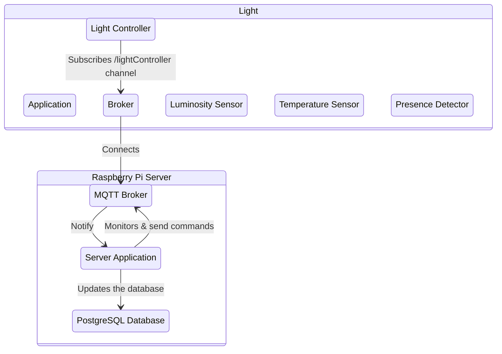
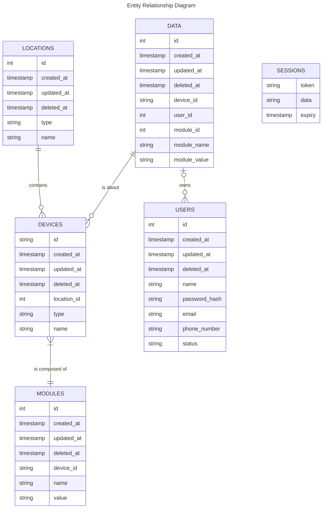
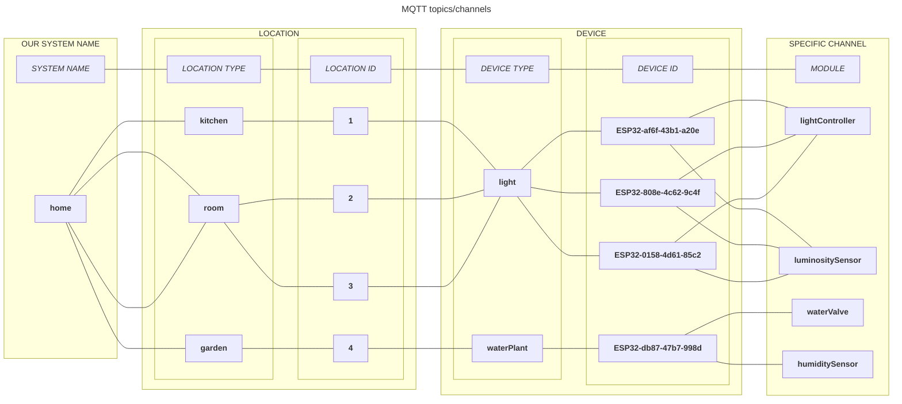
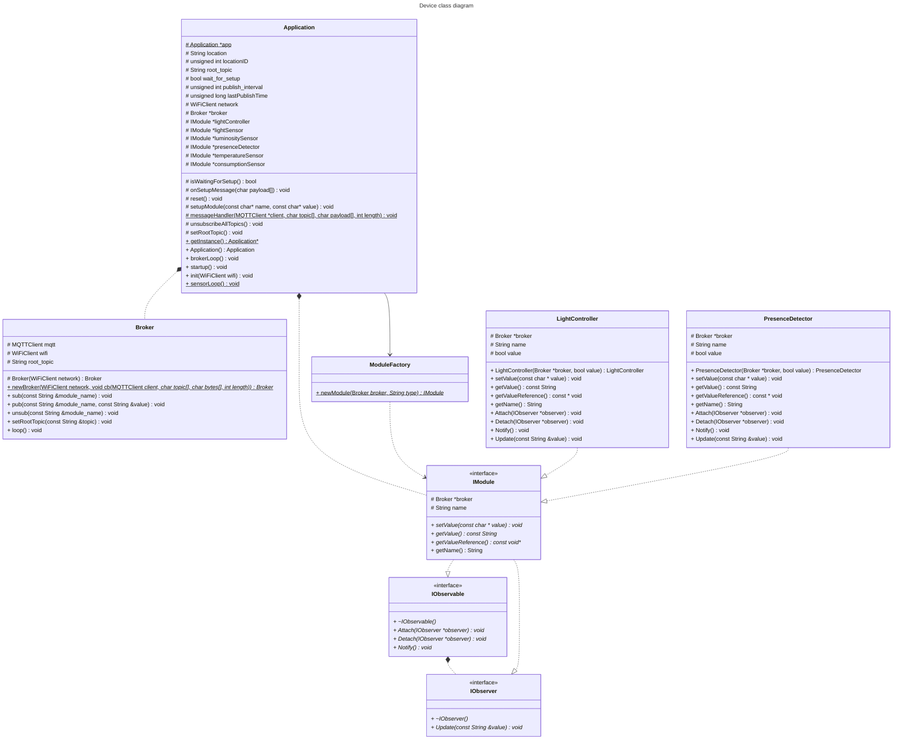
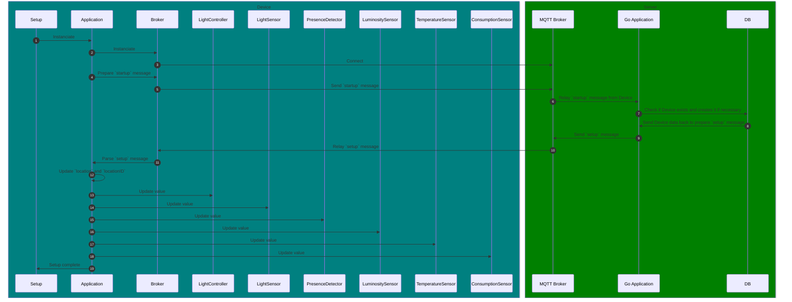

---

## Presentation

This project is made by Computer Science students for an assignment.

**Home&Co** _(Co for Connect, Control, Company)_ is a project using **ESP32** dev boards and a **Raspberry Pi 3B+** to monitor, control and automate home appliances like the lights, heaters, front door, water valves for watering plants, etc.

Its objectives are to provide **security**, **control**, **comfort**, **peace of mind** and **energy saving** to your home.

### 1. Security

Our front door device will control the access policy of the front door of your home:
- **RFID** sensor needing a **badge** to open the door
- **bell button** ringing the bell and **notifying you on your phone**
- **locking mechanism** controlled **remotely** (no need to give keys to anybody)
- **presence detector** to **monitor** the activity in front of the door
- **house locking function** to **automatically turn off** all the lights and use all presence detectors as **intrusion detectors**

### 2. Control

You can use the website to **remotely control at any time** the _lights_, the _door_, the _heaters_ and the _watering of plants_.

You have the **full control of your house** from any device.

### 3. Comfort

You can **automate the heaters** to activate at any time of the day, to find a warm house when coming back from a hike, vacation or any activity.

### 4. Peace of mind

You won't have to go through your check list three times or ask your neighbour to water your plants before going out!

You can **monitor your house from any device** using the website in **real time**: from the _presence detectors_ to the _lights_, _heaters_, _humidity of the plants_ and _temperature of any room_.

### 5. Energy saving

No need to keep heating your home when you're not there!

You'll be able to control and monitor the **heaters** remotely and according to your needs and presence at home.

You'll also be able to **monitor the energy of specific high consumption appliances** with our **smart power outlet** and control them remotely, and even give them schedules to be working or not.


## How it works

### Needs analysis

- Fully functional home with remote control (from phone or any other device)
- Security: no direct access to sensors or actuators (ESP32), to database, MQTT or backend application.
- Raspberry Pi 3 or more for WiFi access point, MQTT, backend app and webserver.
- ESP32 for sensors & actuators

### Technical choices

- Golang for the backend app and webserver with GORM: easy to use system language with good web libraries and ORM
- PostgreSQL for the database: the best Open Source database
- Mosquitto for the MQTT broker: good Open Source MQTT broker (up to date and good documentation)
- RaspAP for the WiFi Access Point in the Raspberry Pi: the most updated and documented Access Point software we found
- Websocket between JavaScript clients and Golang server: best solution for event driven actualization in the frontend.
- PlatformIO and C/C++ for the ESP32: the most manageable software to compile and upload C/C++ code on ESP32


### Architecture



### Database



### Incoming features

- Monitoring sensors with the web interface
- Controlling actuators from the web interface

### MQTT




### Class diagram



### Startup / Setup

#### Startup/Setup message
```json
{
  "id": "ESP32-af6f-43b1-a20e",
  "type": "light",
  "location_id": 3,
  "location_type": "room",
  "location_name": "room 3",
  "modules": [
    {
      "name": "lightController",
      "value": "False"
    },
    {
      "name": "lightSensor",
      "value": "True"
    },
    {
      "name": "luminositySensor",
      "value": "150.0"
    },
    {
      "name": "presenceDetector",
      "value": "True"
    },
    {
      "name": "temperatureSensor",
      "value": "22.5"
    },
    {
      "name": "consumptionSensor",
      "value": "32.45"
    }
  ]
}
```

#### Setup sequence diagram

